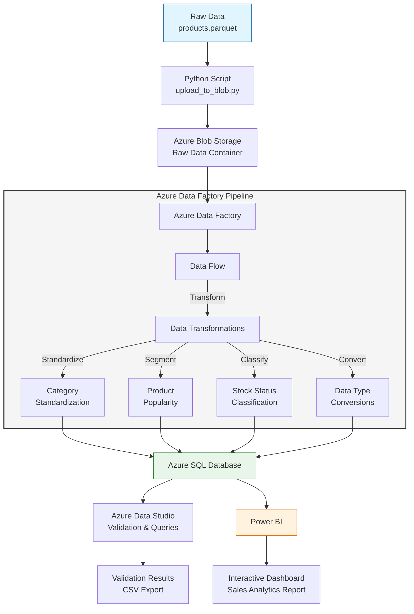

# Cloud-Based ETL Pipeline: Sales Data Transformation with Azure & Power BI

## Executive Summary

This repository presents a robust, end-to-end ETL (Extract, Transform, Load) pipeline for sales data, leveraging Microsoft Azure services and Power BI for scalable data processing and insightful analytics. The solution demonstrates best practices in cloud data engineering, from ingestion to visualization, and is suitable for enterprise-grade analytics workflows.

---

## Features

- Automated ingestion of raw sales data in Parquet format
- Secure upload to Azure Blob Storage
- Orchestrated ETL with Azure Data Factory (ADF)
- Data transformation: category standardization, stock status, popularity segmentation, and type conversions
- Structured storage in Azure SQL Database
- Data validation and querying with Azure Data Studio
- Interactive dashboards and business intelligence with Power BI
- Modular Python scripts for extraction, loading, and cloud integration

---

## Architecture Overview

### End-to-End Data Pipeline



1. **Data Ingestion**
    - Extract sales data from external Parquet sources
    - Upload to Azure Blob Storage using Python automation

2. **Data Transformation & Load**
    - Orchestrate ETL with Azure Data Factory:
        - Extract from Blob Storage
        - Transform data (standardization, classification, segmentation, type conversion)
        - Load into Azure SQL Database

3. **Data Storage & Querying**
    - Store processed data in Azure SQL Database
    - Validate and analyze using Azure Data Studio

4. **Data Visualization**
    - Build Power BI dashboards for business insights:
        - Stock status distribution
        - Average price per category
        - Product popularity by category
    - Reports available in .pbix and .pdf formats

---

## Technologies Used

- **Azure Storage Account**: Cloud storage for raw data
- **Azure Data Factory**: ETL orchestration and transformation
- **Azure SQL Database**: Structured data storage
- **Azure Data Studio**: SQL querying and validation
- **Power BI**: Data visualization and reporting
- **Python**: Scripting for automation and integration
- **GitHub**: Version control and collaboration

---

## Project Structure

```
/azure-sales-pipeline/
│── config/                          # Configuration files
│   ├── config.py                    # Main configuration script
│
│── data/                            # Data storage
│   ├── processed/                   # Processed data
│   │   ├── Results_pipeline_sql_data_studio.csv  # Processed results
│   ├── raw/                         # Raw data
│   │   ├── products.parquet         # Original dataset
│
│── images/                          # Project images
│   ├── azure_data_factory/          # Azure Data Factory visuals
│   ├── azure_data_studio_sql/       # Azure Data Studio screenshots
│
│── reports/                         # Analytical reports
│   ├── power_bi/                    # Power BI reports (.pbix, .pdf)
│
│── src/                             # Source code
│   ├── extract_data.py              # Data extraction script
│   ├── load_to_sql.py               # SQL loading script
│   ├── upload_to_blob.py            # Blob upload script
│
│── venv/                            # Python virtual environment
│── .env                             # Environment variables
│── .gitignore                       # Git ignore file
│── README.md                        # Project documentation
│── requirements.txt                 # Python dependencies
```

---

## Getting Started

### Prerequisites
- Python 3.8+
- Azure Subscription (Blob Storage, SQL Database, Data Factory)
- Power BI Desktop (for .pbix reports)

### Setup Instructions
1. Clone this repository
2. Create and activate a Python virtual environment
3. Install dependencies: `pip install -r requirements.txt`
4. Configure environment variables in `.env` and `config/config.py`
5. Follow the deployment steps below

---

## Deployment Steps

1. **Provision Azure Resources**
    - Create Azure Storage Account (Blob Storage)
    - Deploy Azure SQL Database
    - Set up Azure Data Factory

2. **Configure Data Pipeline**
    - Create Linked Services in ADF (Blob Storage & SQL)
    - Define Datasets for Parquet and SQL
    - Implement Data Flow Activity pipeline:
        - Extract from Blob Storage
        - Transform data
        - Load into SQL Database

3. **Run & Monitor Pipeline**
    - Trigger ETL pipeline in ADF
    - Monitor execution in ADF UI
    - Validate processed data in Azure Data Studio

4. **Visualize in Power BI**
    - Open `.pbix` report in Power BI Desktop
    - Refresh data and explore dashboards

---

## Screenshots & Proof of Work

- Azure Data Factory pipeline execution
- Data Flow transformations
- SQL validation in Azure Data Studio
- Power BI dashboards

All visuals are available in the `images/` and `reports/power_bi/` directories.

---

## Author

**Alexandre Vidal**  
[alexvidaldepalol@gmail.com](mailto:alexvidaldepalol@gmail.com)  
[LinkedIn](https://www.linkedin.com/in/alex-vidal-de-palol-a18538155/)  
[GitHub](https://github.com/alexvidi)

**Project Repository:** [Azure_Project_ETL_SQL_PowerBI](https://github.com/alexvidi/Azure_Project_ETL_SQL_PowerBI)

---

## License

This project is licensed under the MIT License. See `LICENSE` for details.


