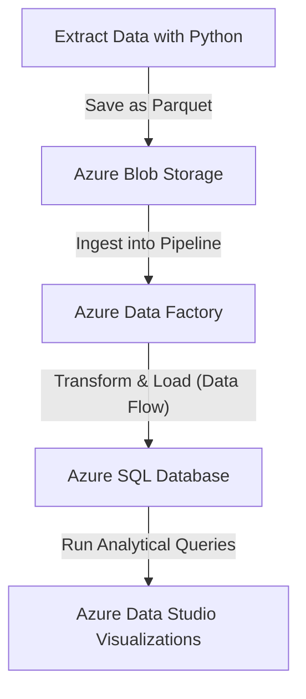

# Azure ETL Pipeline with Data Factory & Azure SQL (Azure Data Studio Analytics)

## Overview

This repository implements an end-to-end, cloud-native ETL (Extract–Transform–Load) pipeline for product data using **Python**, **Azure Blob Storage**, **Azure Data Factory (ADF)**, **Azure SQL Database**, and **Azure Data Studio**. It demonstrates modern data engineering practices from ingestion to transformation and SQL-driven analytics.

---

## Features

- **Automated Data Extraction**: Fetch product data via Python and persist it in efficient **Parquet** format.
- **Cloud Ingestion**: Upload raw Parquet files securely to **Azure Blob Storage**.
- **Orchestrated Transformation (ADF)**: Ingest, transform, and load into **Azure SQL** using ADF Data Flows.
  - Derived columns: `finalPrice`, `ratingCategory`, `stockValue`, `stockAlertLevel`.
  - Loads the enriched dataset into `dbo.Products_Enriched`.
- **Analytical SQL Queries**: Designed and executed in **Azure Data Studio** to explore and visualize product insights.
- **Infrastructure as Code**: Exported **ARM templates** for ADF to enable reproducible deployment.

---

## Solution Architecture



---

## Repository Structure

```
Azure_Project_ETL_SQL_PowerBI/
├── adf_templates/ # Exported ARM templates (ADF) + visuals
│   ├── factory_base/
│   │   ├── alexvidi-adf-sales-pipeline_ARMTemplateForFactory.json
│   │   └── alexvidi-adf-sales-pipeline_ARMTemplateParametersForFactory.json
│   ├── images/ # Screenshots of Data Flow & Pipeline
│   │   ├── dataflow_products_enriched_derived_sink.png
│   │   └── dataflow_sink_mapping_products_enriched.png
│   ├── master_deployment/
│   │   ├── ArmTemplate_0.json
│   │   ├── ArmTemplate_master.json
│   │   └── ArmTemplateParameters_master.json
│   ├── pipeline_deployment/
│   │   ├── ARMTemplateForFactory.json
│   │   └── ARMTemplateParametersForFactory.json
│   └── README_ADF.md
│
├── config/
│   └── config.py # Project config (non-secrets)
│
├── data/
│   └── raw/
│       ├── products.csv
│       └── products.parquet # Extracted Parquet dataset
│
├── queries ADS/ # SQL analytical queries (Azure Data Studio)
│   ├── average_rating_by_category.sql
│   ├── high_discount_high_rating_products.sql
│   └── top3_products_by_stock_value.sql
│
├── visualizations ADS/ # Chart from Azure Data Studio
│   └── product stock status by category.png
│
├── src/ # ETL Python scripts
│   ├── extract_data.py
│   └── upload_to_blob.py
│
├── .env # Environment variables (not committed)
├── requirements.txt # Python dependencies
├── README.md 
└── .gitignore
```

---

---

## How to Run the Project

### 1. Extract Data Locally
Run the Python extraction script to generate the Parquet file:

```bash
python src/extract_data.py
```

### 2. Upload Data to Azure Blob Storage
Upload the generated dataset to Azure:

```bash
python src/upload_to_blob.py
```

### 3. Run Data Flow in Azure Data Factory
1. Open the `alexvidi-adf-sales-pipeline` in the Azure Portal.
2. Trigger the pipeline `PL_DataFlow_ProductsToSQL`.

The Data Flow will:

- Read the Parquet file from Azure Blob.
- Apply 4 derived transformations (`finalPrice`, `ratingCategory`, `stockValue`, `stockAlertLevel`).
- Load the transformed data into Azure SQL table `dbo.Products_Enriched`.

### 4. Run Analytical Queries in Azure Data Studio
Open the SQL files in `/queries ADS` and execute them against your Azure SQL Database to generate insights and charts.

---

## SQL Analytics & Visualization

All analytical queries were executed in **Azure Data Studio**.  
Each script explores a different business insight:

| Query | Description |
|-------|--------------|
| `average_rating_by_category.sql` | Calculates the average rating per product category. |
| `high_discount_high_rating_products.sql` | Identifies high-rated products with strong discounts and available stock. |
| `top3_products_by_stock_value.sql` | Ranks top 3 products by total stock value in each category. |

### Visualization
All results were visualized directly in **Azure Data Studio Charts**, such as:
- **Product Stock Status by Category** (`visualizations ADS/product stock status by category.png`)

---

## Deployment & Infrastructure

All Azure Data Factory assets (pipelines, datasets, linked services, and data flows) are exported as **ARM templates** for full reproducibility.

To redeploy this factory:

```bash
az deployment group create \
  --resource-group data-lake-rg \
  --template-file adf_templates/master_deployment/ArmTemplate_master.json \
  --parameters @adf_templates/master_deployment/ArmTemplateParameters_master.json \
  --parameters factoryName="alexvidi-adf-sales-pipeline"
```

The templates can be found under `adf_templates/`, organized by factory, pipeline, and master deployment scope.

---


## Author

**Alexandre Vidal**  
[alexvidaldepalol@gmail.com](mailto:alexvidaldepalol@gmail.com)  
[LinkedIn](https://www.linkedin.com/in/alex-vidal-de-palol-a18538155/)  
[GitHub](https://github.com/alexvidi)

---

## License

This project is licensed under the MIT License. See `LICENSE` for details.


